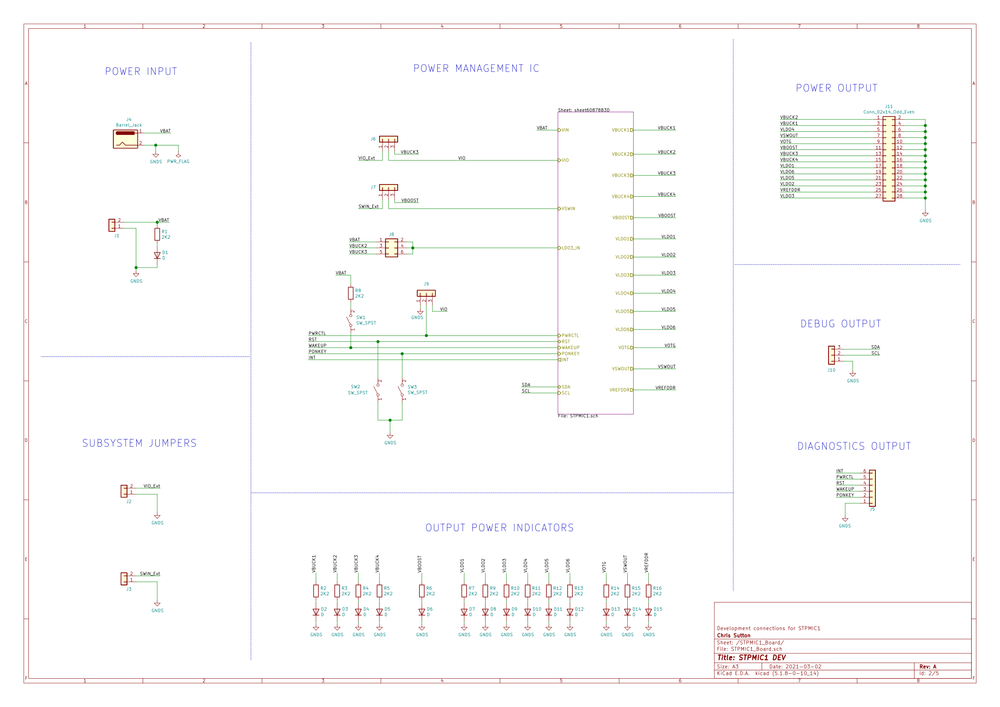

# STPMIC1 / PF3000 PMIC Dev Board

Dual development board for evaluating STMicroElectronics STPMIC1 and NXP PF3000 Power Management ICs.

[Bill of Materials](STPMIC1_MC32PF3000_Board/STPMIC1_MC32PF3000_Board/docs/bom/STPMIC1_MC32PF3000_Board with LCSC Extended Parts.csv)

Related application notes, datasheets and reference design can be found in this repository.

RevA build files can be found in the gerbers directory.

Below are some svg images of the schematics.

## NXP PF300 Schematics

### IC schematic

### IC Support Schematic

## STMicroElectronics STPMIC1 Schematics

### IC Schematic

### IC Support Schematic

