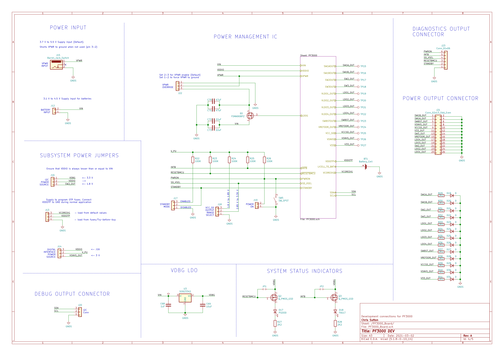

# STPMIC1 / PF3000 PMIC Dev Board

Dual development board for evaluating STMicroElectronics STPMIC1 and NXP PF3000 Power Management ICs.

[Bill of Materials](STPMIC1_MC32PF3000_Board/STPMIC1_MC32PF3000_Board/docs/bom/FULL_STPMIC1_MC32PF3000_Board.csv)

Related application notes, datasheets and reference design can be found in this repository.

RevA build files can be found in the gerbers directory.

Below are circuit details with connector and jumper/switch details.

## PMIC #1: NXP PF300

### Board connector definitions

| Connector | Description | Comment |
|:---:|:---:|:---|
|J15|Wall adaptor power input|3.7V - 5.5V DC Barrel 2.1mm|
|J12|Battery power input|3.1V - 4.5V 2.54mm Header|
|J20|I2C debug|1: Ground 2: SCL 3: SDA|
|J23|Digital Interface (see datasheet)|1: Ground 2: STANDBY 3: RESETBMCU 4: SD_VSEL 5: INTB 6: PWRON|
|J21|PF3000 Power Output|Ground: 2,4,6,8,10,12,14,16,18,20,22,24,26  1: SW1B Buck  3: SW1A Buck  5: SWBST Boost 7: VSNVS LDO 9: VCCSD LDO 11: V33 LDO  13: SW3 Buck 15: VREFDDR LDO 17: LDO4  19: LDO3 21: SW2 Buck 23: LDO2  25: LDO1

### Board jumper and switch definitions

Warning: logic of jumpers can be inverted using the registers. See datasheet for details.

| Jumper/Switch | Description| Setting | Comment |
|:---:|:---:|:---:|:---|
|JP1|Q2 Pullup|ON|Force Q2 gate to VDBG rail.  Use if PGOOD LED becomes erratic.|
|JP2|Q3 Pullup|ON|Force Q3 to VDBG rail.  Use if FAIL LED becomes erratic.|
|J13|OTP|3-2|Load OTP values from memory into OTP registers|
|J13|OTP|2-1|Disable OTP memory and load OTP values from fuses. "Try before buy" mode.|
|J16|I2C Bus Power (VDDIO)|3-2|Power from VDGB. 3.3V|
|J16|I2C Bus Power (VDDIO)|2-1|Power from Buck 2 output. 1.8V|
|J14|Digital Interface Power (V_PU)|3-2|Power from J16 output|
|J14|Digital Interface Power (V_PU)|2-1|Power from VSNVS output (fixed 3V)|
|J17|Standby|3-2|Enter standby mode|
|J17|Standby|2-1|Exit standby mode|
|J18|VCC_SD output range|3-2|1.8V to 1.85V|
|J18|VCC_SD output range|2-1|2.85V to 3.3V|
|J19|Power enable|2-1|IC power output is enabled|
|SW5|Power enable| - | Momentary SPST. IC power output is enabled.
|J22|VPWR override|3-2|VPWR enable.  Set when J15 DC connector is powered|
|J22|VPWR override|2-1|VPWR disable.  Set when J12 battery power connector is powered. Warning: Shorts J15 to ground!|

### Schematics

| PF3000 Board Schematic | PF3000 IC Schematic |
|:---:|:---:|
|||

## PMIC #2: STMicroelectronics STPMIC1

### Board connector definitions

| Connector | Description | Comment |
|:---:|:---:|:---|
|J2|External VIO|0.5V to 4.2V. I/O voltage (for all digital signals except WAKEUP and PONKEY)|
|J3|External SWIN|0.5V - 7V. External power source for VSWIN pin.
|J4|Wall adaptor power input|0.5V - 7V. DC Barrel 2.1mm|
|J1|Battery power input|0.5V - 7V. 2.54mm Header|
|J10|I2C debug|1: Ground 2: SCL 3: SDA|
|J5|Digital Interface (see datasheet)|1: Ground 2: PONKEY (IN) 3: WAKEUP (IN) 4: RST (BOTH) 5: PWRCTL (IN) 6: INT (OUT)|
|J21|STPMIC1 Power Output|Ground: 2,4,6,8,10,12,14,16,18,20,22,24,26  1: Buck2  3: Buck1  5: LDO4 7: VSWOUT LDO 9: VOTG LDO 11: Boost  13: Buck3 15: Buck4 17: LDO1  19: LDO6 21: LDO5 23: LDO2  25: VREFDDR LDO 27: LDO3|

### Board jumper and switch definitions

Warning: logic of some jumpers can be inverted using the registers. See datasheet for details.

| Jumper/Switch | Description| Setting | Comment |
|:---:|:---:|:---:|:---|
|J6|VIO source select|3-2|Power source from Buck3 output|
|J6|VIO source select|2-1|Power source from VIO Ext (J2)|
|J7|VSWIN source select|3-2|Power source from BOOST output|
|J7|VSWIN source select|2-1|Power source from SWIN Ext (J3)|
|J8|LDO3 source select|1-2|Power source from VBAT (J4 or J1)|
|J8|LDO3 source select|3-4|Power source from BUCK2 output|
|J8|LDO3 source select|5-6|Power source from BUCK2 output|
|J9|PWRCTL Pullup/Pulldown|3-2|Pullup from VIO (J6)|
|J9|PWRCTL Pullup/Pulldown|2-1|Pulldown to ground|
|SW1|Wakeup enable| - |Momentary SPST to VBAT|
|SW2|IC Reset| - |Momentary SPST to ground|
|SW3|PONKEY| - |User power on key|

### Schematics

| PF3000 Board Schematic | PF3000 IC Schematic |
|:---:|:---:|
||

